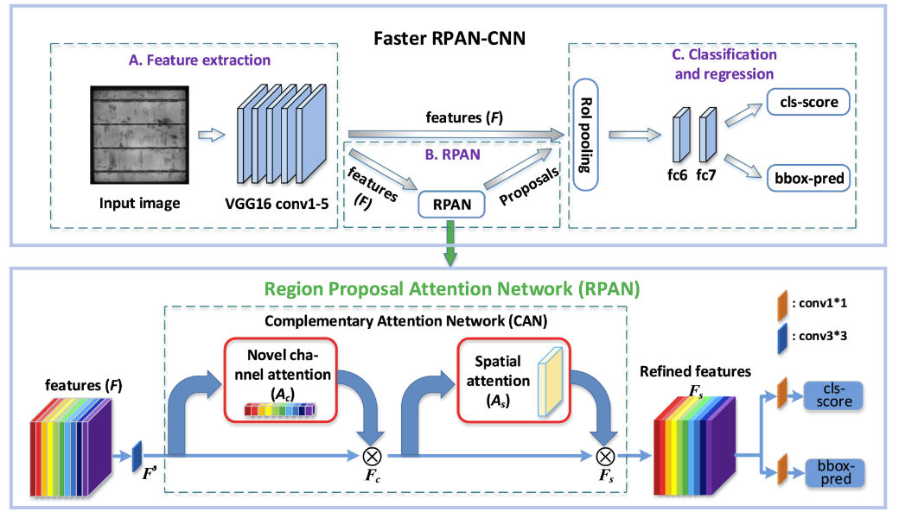
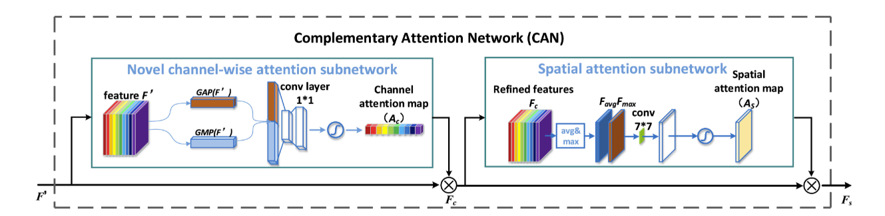

# Faster-RPAN-CNN

根据论文《Deep Learning-Based Solar-Cell Manufacturing Defect Detection With Complementary Attention Network》复现的Faster RPAN-CNN pytorch版。

该网络基于Faster R-CNN，其网络架构如下：

can模块的结构图如下：

论文链接：https://ieeexplore.ieee.org/document/9136904/

Faster R-CNN代码来自B导：https://github.com/bubbliiiing/faster-rcnn-pytorch ，相关网络的权重可去他仓库的链接下载

can模块的tf版本来自论文原作者：https://github.com/binyisu/Complementary-Attention-Network

我根据论文作者提供的tf版的代码写了这个pytorch版的
